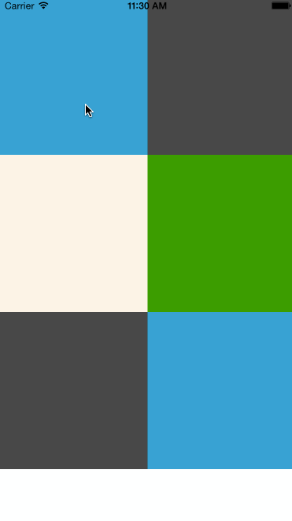

# react-native-drop-refresh-ios

A pull down to refresh control for react native.
This is a fork version from [react-native-china/react-native-drop-refresh](https://github.com/react-native-china/react-native-drop-refresh).

## FIX to meet react-native <= 0.42.x

## Screen Shot



## Installation

1. Put code to where you want to put
1. Add `DropRefreshControl.xcodeproj` to your project.
1. Add `libDropRefreshControl.a` to path `Project-Build Phases-Link Binary With Libraries`
1. Add `import DropRefreshControl from 'DropRefreshControl.ios.js';` to your code.

## Usage

```javascript
import React, { Component } from 'react';
import DropRefreshControl from './DropRefreshControl.ios.js';

import {
  AppRegistry,
  ListView,
  ScrollView,
  StyleSheet,
  Text,
  View
} from 'react-native';

var SCROLLVIEW = 'ScrollView';
var LISTVIEW = 'ListView';

export default class RCTRefreshControlDemo extends Component{
  constructor(p) {
    super(p)
    var ds = new ListView.DataSource({rowHasChanged: (r1, r2) => r1 !== r2});
    this.state = {
      dataSource: ds.cloneWithRows(['#484848', '#2F9C0A', '#05A5D1']),
    }
  }

  componentDidMount() {
    // ScrollView
    DropRefreshControl.configure({
      node: this.refs[SCROLLVIEW],
      tintColor: '#05A5D1',
      activityIndicatorViewColor: '#05A5D1'
    }, () => {
      setTimeout(() => {
        DropRefreshControl.endRefreshing(this.refs[SCROLLVIEW]);
      }, 2000);
    });

    // ListView
    DropRefreshControl.configure({
      node: this.refs[LISTVIEW]
    }, () => {
      setTimeout(() => {
        DropRefreshControl.endRefreshing(this.refs[LISTVIEW]);
      }, 2000);
    });
  }

  render() {
    return (
      <View style={styles.container}>
        <ScrollView ref={SCROLLVIEW} style={styles.scrollView}>
          <View style={{backgroundColor: '#05A5D1', height: 200}} />
          <View style={{backgroundColor: '#FDF3E7', height: 200}} />
          <View style={{backgroundColor: '#484848', height: 200}} />
        </ScrollView>

        <ListView
          ref={LISTVIEW}
          style={styles.listView}
          dataSource={this.state.dataSource}
          renderRow={(rowData) => {
            var color = rowData;
            return (
              <View style={{backgroundColor: color, height: 200}} />
            );
          }}
        />
      </View>
    );
  }
};

var styles = StyleSheet.create({
  container: {
    flex: 1,
    flexDirection: 'row'
  }
});

```

---

## License

Available under the MIT license. See the LICENSE file for more informatiion.
